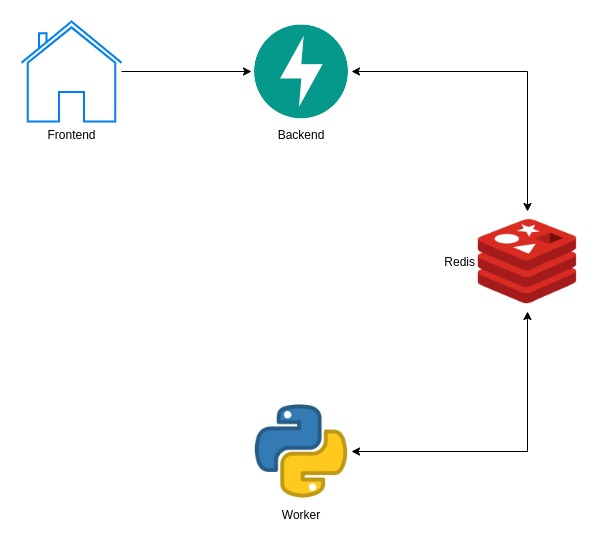
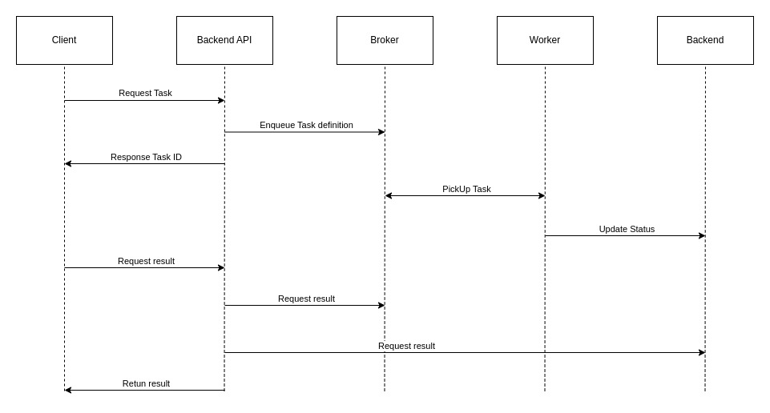

### current situation
Currently we are having some timeout errors related with endpoints that execute long-running task that takes more than 100 seconds.
To avoid this, we are seeking at some options to run these tasks in the background. This should be transparent to users.

### Possible solutions
#### Celery
Celery is a simple, flexible, and reliable distributed system  to manage background tasks using queues and also supports task scheduling.

##### Infrastructure
Celery requires a broker to queue tasks and a back-end to store task results. There are some options [here](https://docs.celeryq.dev/en/stable/getting-started/backends-and-brokers/index.html). 
Redis can be use for both broker and back-end.

Another option could be using AWS [SQS](https://aws.amazon.com/sqs/)as broker and [DYNAMODB](https://aws.amazon.com/dynamodb/) as back-end.

##### Pipeline
The basic pipeline could be as follow:
- Front-end user send request to back-end
- Back-end send Task definition to redis and response with task id to front-end
- Front-end keeps loading page and start polling periodic for task result from back-end
- Workers are listening to redis queue and takes task
- Workers execute tasks and save result in redis
- For each front-end task is status request, Back-end read task status from redis. If status is "Finished" it returns result to front-end

##### Monitoring
[Flower](https://flower.readthedocs.io/en/latest/) is a lightweight, real-time, web-based monitoring tool for Celery

#### Considerations
##### Pros
- Workers runs separately from the app, this way it avoids blocking the app.
- Its stable and has a big community
- its lightweight and scalable
- Task results are the same as if task was run from the app (even error raising)

##### Cons
- Workers requires the same code as app.
- requires extra infrastructure
